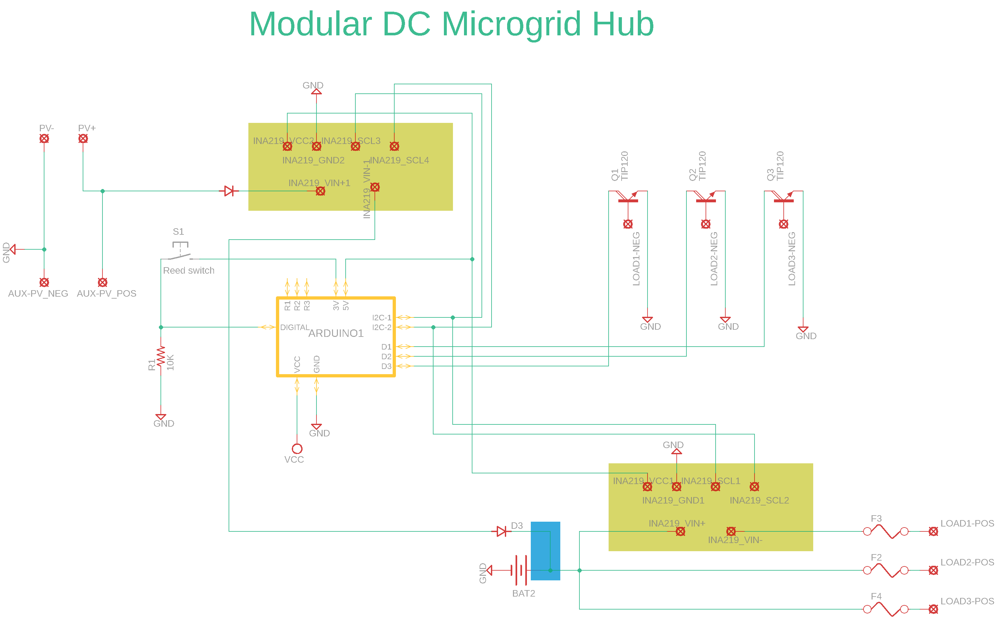

# smartDCloadcenter

A smart DC load center for managing intermittency in off-grid renewable energy systems. This enables designing energy centered physical experiences.

## Data Collection

* PV production
* battery status
* total load draw
* branch load draw
* seasonal weather trends
* day ahead weather report

## Interface

### Load Definition

* critical loads vs shedable loads
* time sensitive vs temporal shifting

### Timing and energy distribution priorities

* ideal scenario
* worst case scenario
* priorities
	* instantaneous, daily, day-ahead, week

### User provided data

* system specs

### Dev

`.\venv\Scripts\activate`

### misc

motor driver: https://github.com/CytronTechnologies/CytronMotorDrivers